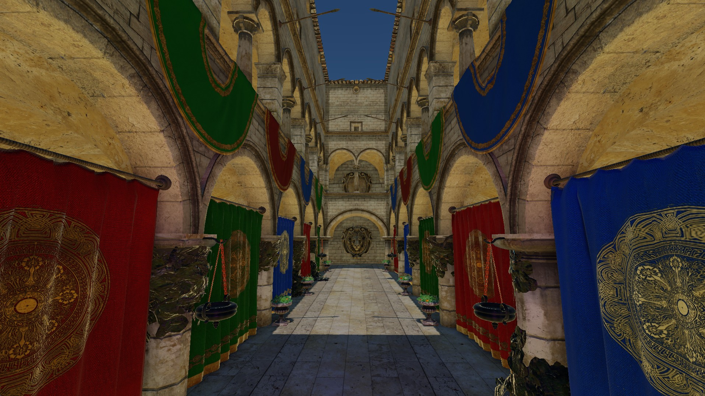

# vkEngine 



vkEngine is a toy game engine currently in development. 
It uses [Vulkan](https://www.lunarg.com/vulkan-sdk/) as the rendering backend, integrates [JoltPhysics](https://github.com/jrouwe/JoltPhysics) for real-time physics simulation, and embeds [CoreCLR](https://github.com/dotnet/runtime) as the scripting runtime for C#. 

The project is primarily intended as a platform for experimenting with graphics and game development techniques. 

## Requirements 

- Windows 10/11 
- [Visual Studio 2022](https://visualstudio.microsoft.com/) (with C++23 support)  
- [Miniconda/Anaconda](https://docs.conda.io/) 
- [VulkanSDK](https://www.lunarg.com/vulkan-sdk/) >= 1.4 
- [.NET SDK 9.0](https://dotnet.microsoft.com/) 

## Build

``` bash
git clone --recursive https://github.com/Al0ha0e/vkEngine.git
cd vkEngine
conda create -n vkengine python=3.12
conda activate vkengine
pip install -r requirements.txt
python init_project.py
scons
```

`SConstruct` will also:

- build `csharp/EngineCore`
- build the test gameplay assembly under `tests/csharp`
- run the reflection code generator for `GameConfig`
- compile the builtin shaders

`init_project.py` creates the local build/generated directories and generates the builtin LUT textures needed by the renderer.

## Run

The build will produce `out/engine.exe`. The executable expects a single game config json:

```
./out/engine.exe ./tests/cfg/test_sponza.json
./out/engine.exe ./tests/cfg/test_jolt.json
./out/engine.exe ./tests/cfg/test_anim.json
./out/engine.exe ./tests/cfg/test_env.json
./out/engine.exe ./tests/cfg/test_render.json
```

## Third Party Libraries 

- [glfw](https://github.com/glfw/glfw) 
- [SPIRV-Reflect](https://github.com/KhronosGroup/SPIRV-Reflect) 
- [stb_image](https://github.com/nothings/stb) 
- [assimp](https://github.com/assimp/assimp) 
- [tinygltf](https://github.com/syoyo/tinygltf)
- [VulkanMemoryAllocator](https://github.com/GPUOpen-LibrariesAndSDKs/VulkanMemoryAllocator)
- [nlohmann/json](https://github.com/nlohmann/json)
- [spdlog](https://github.com/gabime/spdlog)  
- [JoltPhysics](https://github.com/jrouwe/JoltPhysics) 
- [ozz-animation](https://github.com/guillaumeblanc/ozz-animation)
- [entt](https://github.com/skypjack/entt)
- [freetype](https://freetype.org/)
- [recastnavigation](https://github.com/recastnavigation/recastnavigation)
- [miniaudio](https://github.com/mackron/miniaudio)


## Roadmap 

- **Frame Graph**:
  - [x] support for multiple queue families 
  - [x] transient resource allocation 
  - [ ] transient resource schedule optimize
- **Rendering**:
  - [x] cluster-based deferred rendering & PBR 
  - [x] forward transparent rendering 
  - [x] directional/spot/point lights
  - [x] IBL
  - [x] SSAO
  - [x] post-processing: bloom, tone mapping
  - [x] directional light CSM with PCF
  - [x] spot light shadows
  - [ ] point light shadows
- **UI**
  - [x] SDF Font
  - [ ] UI transform: anchor, pivot, size, scale
  - [ ] basic widgets: text, image, panel, button
  - [ ] input/event handling: hover, click, focus
- **Physics**:
  - [x] rigidbody
  - [x] collision detection
  - [x] spatial queries
  - [x] character controller
  - [ ] constraints
- **Animation**:
  - [x] animation sampling
  - [x] GPU skinning
  - [ ] blending
  - [ ] root motion
  - [ ] IK
- **Scripting**:
  - [x] CoreCLR integration
  - [x] script lifecycle
  - [ ] python-based preprocessing tool to generate metadata 
